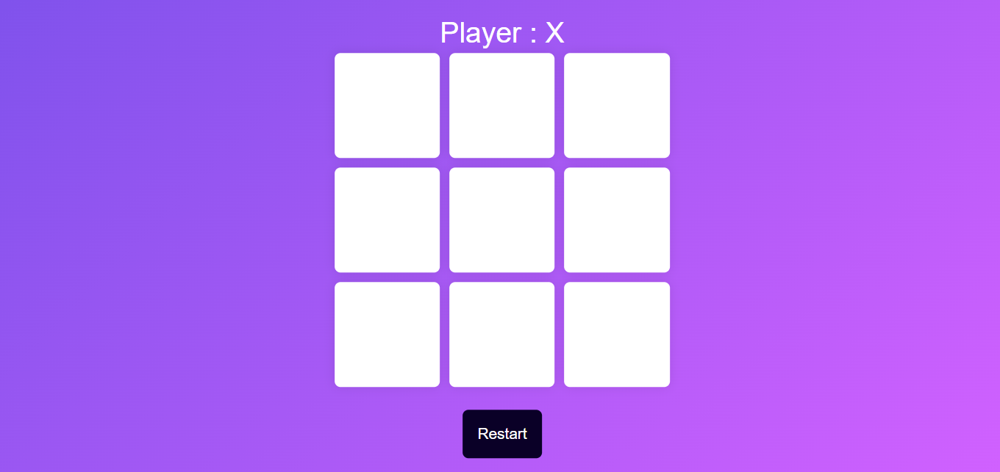

# Tic Tac Toe Game

Welcome to the Tic Tac Toe Game repository! This is a simple web-based implementation of the classic Tic Tac Toe game using HTML, CSS, and JavaScript. This game allows two players to take turns and compete against each other.

## How to Play

1. Clone or download the repository to your local machine.
2. Open the `index.html` file in your preferred web browser.
3. The game board will be displayed, consisting of a 3x3 grid.
4. Player 1 starts as 'X', and Player 2 starts as 'O'.
5. Players take turns clicking on an empty cell on the grid to place their respective symbols.
6. The first player to get three of their symbols in a row, column, or diagonal wins the game.
7. If no player achieves three in a row and the board is full, the game ends in a draw.
8. To restart the game at any point, simply refresh the page or can click on "New Game".

## Features

- Responsive design that works well on various screen sizes, from desktops to mobile devices.
- Simple and intuitive user interface for a smooth gaming experience.
- Real-time turn-based gameplay with clear indicators for each player's turn.
- Win and draw conditions are automatically detected and announced.
- Easy-to-understand codebase for the game logic and user interface.
- Separation of concerns with separate HTML, CSS, and JavaScript files.

## Technologies Used

- HTML
- CSS
- JavaScript

## Folder Structure

- `index.html`: The main HTML file containing the game board and user interface.
- `style.css`: The CSS file for styling the game board and UI elements.
- `script.js`: The JavaScript file containing the game logic and interactivity.
- `images`: This folder contains the images to make the application more attractive.